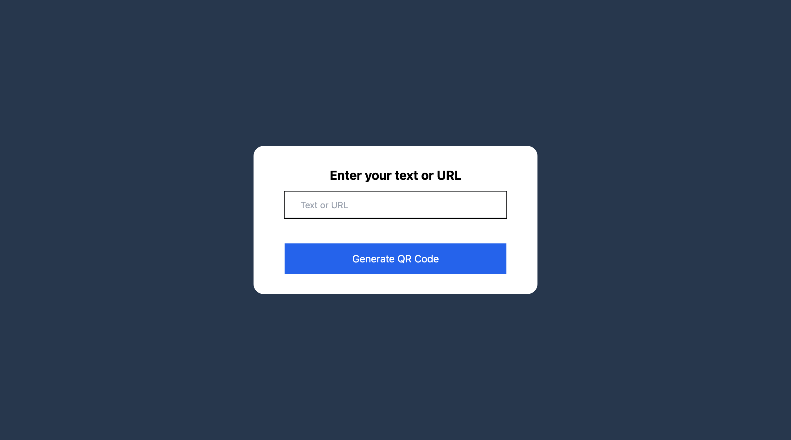
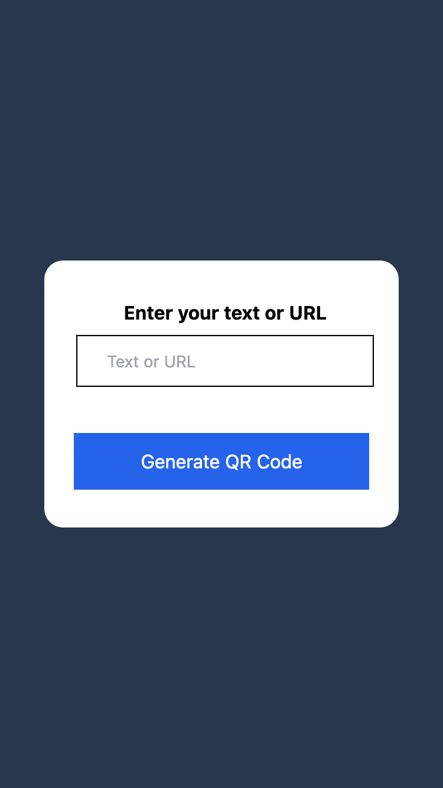
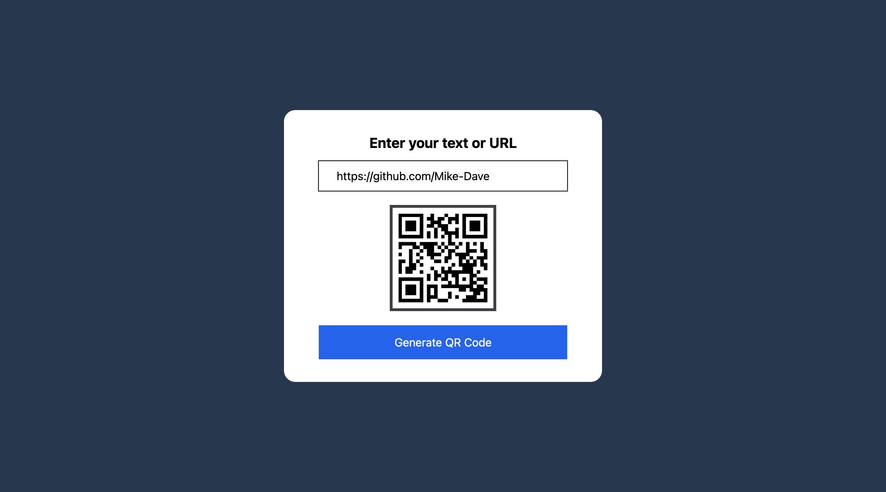

# Random Quote Generator

[Live URL](https://mike-dave.github.io/qr-code-generator/)

## About The Project

This is a QR-code generator. To easily link your website URL or a bunch of text.

Users should be able to:

1. Generate QR code Images
1. Get a responsive layout regardless of their screen size

|  |  |
| ----------------------------------------------------------- | ---------------------------------------------------------- |

|  |  |
| -------------------------------------------------------------- | ------------------------------------------------------------- |

## Built With

- HTML
- Mobile-first workflow
- CSS Flexbox
- Javascript
- DOM manipulation
- Tailwindcss

## Acknowledgement

I got the Idea from this youtube channel [Easy tutorials](https://www.youtube.com/watch?v=g1j9rR-H1lk&t=776s)

## Useful Resources

#### - [Tailwind css](https://tailwindcss.com/) - The official tailwind css documentation.

#### - [ChatGPT](https://chat.openai.com/) - For best practices, approach and daily life comparison and explanation

#### -[QR code API](https://goqr.me/api/doc/create-qr-code/) - This is the API link I used for this project
